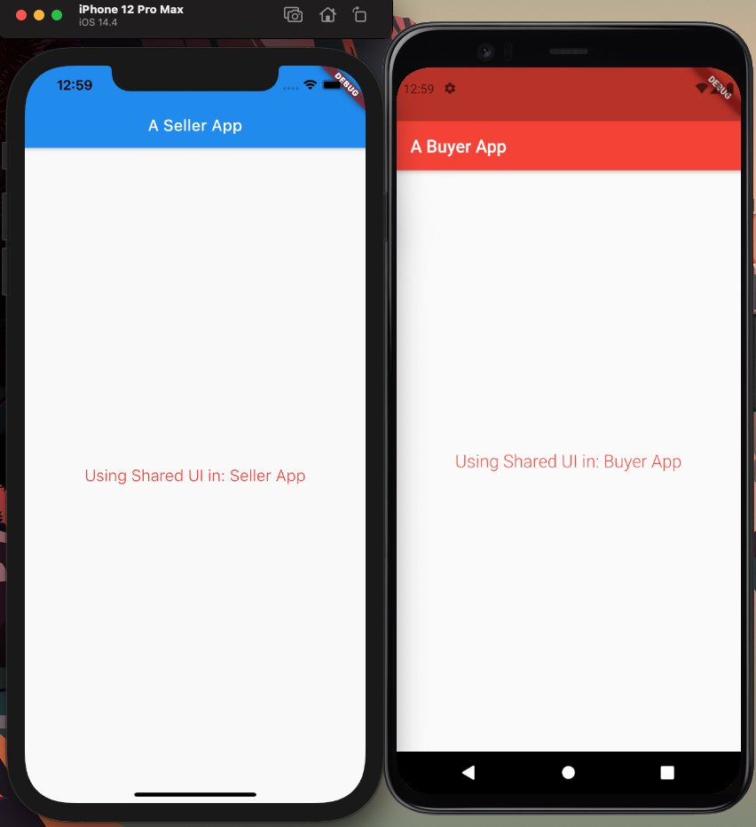

# Flutter monorepo demo

A demo monorepo in Flutter, using melos.

In short, this repositories contains multiple apps that shared the same codebase and reusable components.

The idea can be generalized for various use cases.

## Usage

Clone the repository

`git clone git@github.com:nimblehq/flutter-monorepo-example.git`

### Setup melos

If you are not having `melos` setup, heading to: [here](https://pub.dev/packages/melos) for the config,
then you can start bootstrap with:

 `$ melos bs`

Run the `buyer_app` or `seller_app`:

 `$ melos run run:buyer`

 or 

 `$ melos run run:buyer` 

To run style check on all repositories:

 `$ melos run formatting:check`

To run analyze on all the repo:
 `$ melos run analyze`

The 2 applications (`buyer` and `seller`) shared the same SharedWidget from :shared 

## License

This project is Copyright (c) 2014 and onwards. It is free software,
and may be redistributed under the terms specified in the [LICENSE] file.

[LICENSE]: /LICENSE

## About

This project is maintained and funded by Nimble.

We love open source and do our part in sharing our work with the community!
See [our other projects][community] or [hire our team][hire] to help build your product.

[community]: https://github.com/nimblehq
[hire]: https://nimblehq.co/
